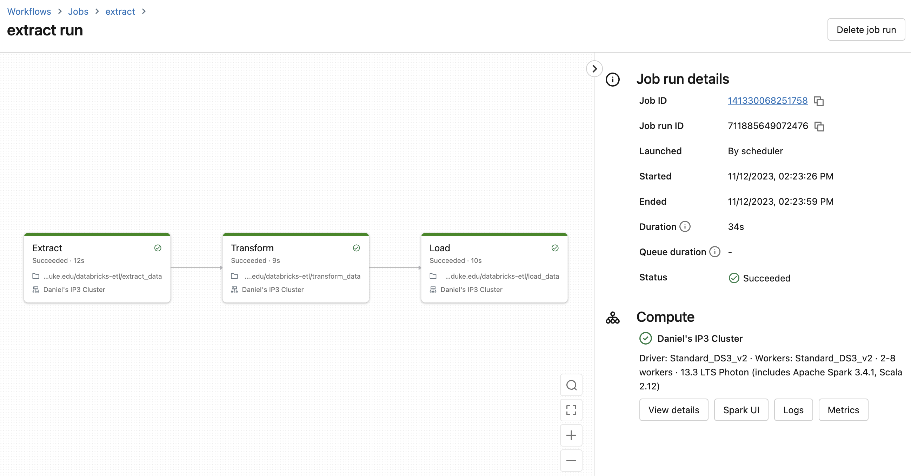

# Databricks ETL Pipeline with Delta Lake, Spark, and Data Visualization
#### By Daniel Medina
Video demo: https://youtu.be/9_CPM-5IfFk
## Overview
This project demonstrates a well-documented ETL (Extract, Transform, Load) pipeline implemented in Databricks notebooks. The pipeline extracts data from a source, transforms it using Spark SQL, loads it into a Delta Lake for storage, and visualizes the transformed data. The process is automated with a trigger to initiate the pipeline. Find the pipeline workflow below:

## Notebooks in the Project
### 1) extract_data
* **Purpose:** Extracts data from a specified JSON source.
* **Key Operations:**
    - Reads data using Spark's DataFrame API.
    - Writes the raw data to a temporary table in Delta format for intermediate storage.

### 2) transform_data
* **Purpose:** Transforms the extracted data.
* **Key Operations:**
    - Reads the extracted data from the Delta table.
    - Applies transformation including adding a processing timestamp and casting the 'time' column to LongType.
    - Stores the transformed data in another temporary Delta table.

### 3) load_data
* **Purpose:** Loads the transformed data into a final Delta table.
* **Key Operations:**
    - Reads the transformed data.
    - Overwrites the existing schema in the Delta table if necessary (using overwriteSchema option).
    - Writes the data to the final Delta table designated for downstream usage.

### 4) visualize_data
* **Purpose:** Visualizes the data from the final Delta table.
* **Key Operations:**
    - Reads from the final Delta table.
    - Performs a simple aggregation (count by action).
    - Uses matplotlib to plot the aggregated data.

## Features and Specifications
* **Delta Lake:** Used for reliable storage of data at each stage of the ETL process, enabling features like ACID transactions and time travel.
* **Spark SQL:** Employed for data transformations, ensuring efficient processing over large datasets.
* **Error Handling** and Data Validation: Each notebook includes error handling and validation steps to ensure data integrity and handle exceptions gracefully.
* **Data Visualization:** The final notebook demonstrates data visualization capabilities, transforming the processed data into insightful charts.
* **Automated Trigger:** The entire ETL pipeline is configured to run automatically, triggered by a scheduled job in Databricks. This ensures regular updates and processing of data without manual intervention. The job is scheduled to run once a week on Sunday at 14:23.

## Usage
1. **Setup:** Clone the repository containing these notebooks into your Databricks workspace.
2. **Configuration:** Modify the file paths and table names as per your environment setup.
3. **Run the Pipeline:** Trigger the pipeline manually for the first run or configure a schedule for automatic execution.
4. **Monitor and Visualize:** Monitor the job runs in the Databricks UI and view the visualizations generated in the visualize_data notebook.

## Dependencies
* Databricks Runtime Environment
* Python Libraries: matplotlib for visualization
* Access to a data source compatible with Spark (e.g., JSON files in this case)

## Conclusion and Recommendations to Management

After thoroughly analyzing the data through our Databricks ETL pipeline, here are some actionable and data-driven recommendations for the management team:

1. **Focus on Key Performance Indicators (KPIs):** Utilize the insights derived from the visualizations to focus on the key performance indicators that are most impactful to the business. For example, if the 'action' column visualized in the `visualize_data` notebook represents customer actions on a website, prioritize features or services with the highest engagement.

2. **Optimize Resource Allocation:** Based on the data trends and counts, allocate resources more efficiently to areas showing higher usage or demand. This could involve scaling up marketing efforts in high-performing areas or reallocating budget towards improving underperforming segments.

3. **Enhance Data-Driven Decision-Making:** Encourage teams to integrate data insights into their decision-making process. Regularly updated dashboards and reports from the ETL pipeline can provide teams with up-to-date information, leading to more informed decisions.

4. **Continuous Monitoring and Improvement:** Establish a routine for continuous monitoring of the data pipeline’s performance and data quality. Use insights to refine the ETL process, ensuring data accuracy and relevancy. This includes regular audits and updates to the data transformation logic as business needs evolve.

5. **Expand Data Analysis Scope:** Consider expanding the scope of data analysis to include additional data sources or more complex analytical techniques (like predictive analytics) to uncover deeper insights.

6. **Invest in Training and Development:** Invest in training programs for staff to enhance their data literacy and ability to utilize data analytics tools. This will empower teams to better understand and leverage the data being processed through the ETL pipeline.

7. **Data Security and Compliance:** Continuously review and enhance data security measures and ensure compliance with relevant data protection regulations. This is crucial as data volume and usage within the organization grow.

By implementing these recommendations, the management team can leverage the full potential of the ETL pipeline, driving improved business outcomes through data-driven strategies. These actions will not only optimize current operations but also pave the way for future growth and innovation.
